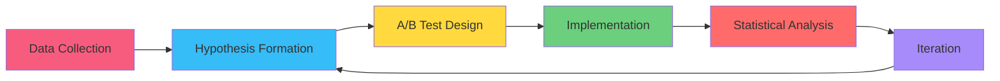

<div align="center">

<!-- HERO SECTION -->
<picture>
  <source media="(max-width: 768px)" srcset="https://capsule-render.vercel.app/api?type=waving&color=gradient&customColorList=6,11,20&height=120&section=header&text=NESER%20UDDIN&fontSize=28&fontColor=fff&animation=twinkling&fontAlignY=32" />
  
</picture>

<br>

<a href="https://proqsoft.com">
  <picture>
    <source media="(max-width: 768px)" srcset="https://readme-typing-svg.demolab.com?font=Fira+Code&weight=600&size=16&pause=800&color=F75C7EFF&center=true&vCenter=true&width=350&lines=Full+Stack+Architect+%F0%9F%92%BB;Odoo+%2B+SAP+Expert+%E2%9A%99%EF%B8%8F;CRO+%26+Growth+Specialist+%F0%9F%93%88;AI+%2B+ML+Engineer+%F0%9F%A4%96;15%2B+Years+Experience+%F0%9F%9A%80" />
    
  </picture>
</a>

<br><br>

<!-- EXPERTISE BADGES -->
<p>
  
  
  
  
</p>

<br>

<picture>
  <source media="(max-width: 768px)" srcset="https://user-images.githubusercontent.com/74038190/212284100-561aa473-3905-4a80-b561-0d28506553ee.gif" width="350" />
  
</picture>

### 🎯 **About Me**

> **15+ years architecting high-performance systems** that drive revenue and optimize conversions.  
> Specialized in **enterprise ERP**, **full-stack development**, and **data-driven CRO**.

<picture>
  <source media="(max-width: 768px)" srcset="https://user-images.githubusercontent.com/74038190/212284100-561aa473-3905-4a80-b561-0d28506553ee.gif" width="350" />
  
</picture>

</div>

---

## 💎 **CORE EXPERTISE**

### 📊 **Conversion Rate Optimization & Growth**
```
✅ 1000+ A/B tests executed across landing pages, checkouts & funnels
✅ 40%+ average conversion rate improvements for e-commerce clients
✅ $1M+ revenue generated through data-driven CRO strategies
✅ Advanced analytics: Google Analytics 4, Mixpanel, Hotjar, FullStory
✅ Funnel optimization: Cart abandonment recovery, checkout optimization
✅ Behavioral analysis: Heatmaps, session recordings, user journey mapping
✅ Multivariate testing: Statistical significance, hypothesis testing
```

### ⚙️ **Enterprise ERP Systems**
```
✅ Odoo: 500+ custom modules | OWL framework | XML views | QWeb reports
✅ SAP: ABAP programming | S/4HANA | Fiori | SAP HANA database
✅ ERPNext: Custom DocTypes | Server/Client scripts | REST API
✅ System integration: 200+ third-party API connections
✅ Data migration: 10TB+ transferred with zero downtime
✅ Business process automation: Workflow design & implementation
```

### 🚀 **Full-Stack Development**
```
✅ Frontend: React 18+, Next.js 14+, Vue 3, TypeScript, Tailwind CSS
✅ Backend: Node.js, NestJS, Python, Django, FastAPI, GraphQL
✅ Database: PostgreSQL, MongoDB, Redis (query optimization expert)
✅ Architecture: Microservices, serverless, event-driven systems
✅ Performance: Sub-second load times, handling 10M+ requests/day
✅ Real-time: WebSockets, Socket.io, server-sent events
```

### 🤖 **AI & Machine Learning**
```
✅ Predictive analytics: Demand forecasting (92% accuracy)
✅ Customer segmentation: ML clustering algorithms
✅ Fraud detection: Anomaly detection models
✅ NLP: Chatbots handling 10K+ queries/month
✅ Recommendation engines: Collaborative filtering
✅ Tools: TensorFlow, PyTorch, Scikit-learn, LangChain, OpenAI API
```

### ☁️ **Cloud & DevOps**
```
✅ AWS: EC2, Lambda, S3, RDS, CloudFront, ECS (Solutions Architect certified)
✅ GCP: Compute Engine, Cloud Functions, BigQuery
✅ Kubernetes: Helm, auto-scaling, service mesh
✅ CI/CD: GitHub Actions, Jenkins, GitLab CI (80% faster deployments)
✅ Infrastructure as Code: Terraform, Ansible
✅ Monitoring: Prometheus, Grafana, ELK stack
```

### 🛒 **E-Commerce & Multi-Channel**
```
✅ Platforms: Shopify (100+ stores), WooCommerce, Magento
✅ Marketplaces: Amazon, eBay integration (10K+ SKUs synced)
✅ Payment gateways: Stripe, PayPal, Razorpay + 20 more
✅ Inventory management: Multi-warehouse, real-time sync
✅ Order processing: Automated fulfillment pipelines
✅ GMV managed: $50M+ across client stores
```

---

## 🌈 **TECHNOLOGY STACK**

<div align="center">

### **Frontend**


### **Backend**


### **Enterprise & ERP**


### **Data & Cloud**


### **AI & Analytics**

<br>


### **Marketing & Analytics**


</div>

---

## 🏆 **PROVEN RESULTS**

<table>
<tr>
<td width="50%">

### **Conversion Optimization**
- 📈 **40%+ average** conversion rate improvements
- 🔬 **1000+ A/B tests** scientifically executed
- 💰 **$1M+ revenue** generated through CRO
- 🎯 **3X-10X ROI** on optimization efforts
- 📊 **500+ campaigns** optimized & scaled

</td>
<td width="50%">

### **Technical Delivery**
- ⚙️ **500+ Odoo modules** developed
- 🏗️ **200+ ERP projects** across 15 countries
- 🚀 **30+ enterprise apps** built from scratch
- ☁️ **15+ cloud migrations** completed
- 🤖 **AI systems** reducing costs by 45%

</td>
</tr>
</table>

---

## 📊 **MY APPROACH TO CRO**



**My CRO Framework:**
1. 🔍 **Quantitative Analysis** - GA4, heatmaps, funnel analysis
2. 🎯 **Qualitative Research** - User surveys, session recordings
3. 💡 **Hypothesis Development** - Data-driven test ideas
4. 🧪 **Experimentation** - A/B/n testing with statistical rigor
5. 📈 **Implementation** - Winner deployment & continuous iteration
6. 🔄 **Optimization Loop** - Never-ending improvement cycle

---

## 💼 **COMPANIES & PROJECTS**

<table>
<tr>
<td align="center" width="33%">

### 🛠️ [**ProqSoft**](https://proqsoft.com)
**Enterprise Software**

Official Odoo Partner  
200+ ERP implementations  
$10M+ project value

<a href="https://proqsoft.com">
  
</a>

</td>
<td align="center" width="33%">

### 📦 [**Fox Parcel**](https://foxparcel.com)
**AI Logistics**

10K+ monthly shipments  
AI-powered fulfillment  
50+ channel integration

<a href="https://foxparcel.com">
  
</a>

</td>
<td align="center" width="33%">

### 📈 [**Spread More**](https://spreadmore.com)
**Digital Growth**

$5M+ ad spend managed  
450% average ROAS  
500+ campaigns launched

<a href="https://spreadmore.com">
  
</a>

</td>
</tr>
</table>

---

## 🎓 **CERTIFICATIONS**

<div align="center">

| **Category** | **Certifications** |
|:---|:---|
| ☁️ **Cloud** | AWS Solutions Architect Professional • GCP Cloud Architect • Azure Solutions Architect • CKA |
| 💻 **Development** | Odoo Technical (v8-v17) • SAP Development Associate • Python PCPP1/PCPP2 • Meta React Advanced |
| 📈 **Marketing** | Google Ads (All) • Facebook Blueprint • Google Analytics IQ • HubSpot Inbound |

</div>

---

## 📈 **GITHUB STATS**

<div align="center">

<picture>
  <source media="(max-width: 768px)" srcset="https://github-readme-stats.vercel.app/api?username=borntohelp&show_icons=true&theme=tokyonight&hide_border=true&bg_color=0D1117&title_color=F75C7E&icon_color=F75C7E&text_color=FFFFFF&rank_icon=github&count_private=true" />
  
</picture>
<picture>
  <source media="(max-width: 768px)" srcset="https://github-readme-stats.vercel.app/api/top-langs/?username=borntohelp&layout=compact&theme=tokyonight&hide_border=true&bg_color=0D1117&title_color=F75C7E&text_color=FFFFFF&langs_count=8" />
  
</picture>

<br><br>


</div>

---

## 🤝 **LET'S COLLABORATE**

<div align="center">

### **I can help you with:**

```
🔧 Custom ERP Development & Integration (Odoo, SAP, ERPNext)
📊 Conversion Rate Optimization & A/B Testing Strategy
🚀 Full-Stack Application Development (React/Next.js + Python)
🤖 AI/ML Integration & Automation Solutions
☁️ Cloud Architecture & DevOps Implementation
🛒 E-commerce Platform Development & Optimization
📈 Digital Marketing & Performance Analytics
```

<br>

### **Connect With Me**

<a href="https://www.linkedin.com/in/borntohelp/">
  
</a>
<a href="mailto:ceo@proqsoft.com">
  
</a>
<a href="https://proqsoft.com">
  
</a>
<a href="https://github.com/borntohelp">
  
</a>

<br><br>

### 💬 **Client Testimonial**

> *"His CRO expertise increased our conversion rate from 1.8% to 3.2% in just 3 months.  
> The A/B testing framework he implemented is still driving results today."*  
> **— Mike Chen, CEO @ FashionHub**

<br>

**🌍 Based in Bangladesh (UTC+6) • 🗣️ Bengali, English, Hindi, Urdu • 🚀 Available for consulting**

<br>

<picture>
  <source media="(max-width: 768px)" srcset="https://capsule-render.vercel.app/api?type=waving&color=gradient&customColorList=6,11,20&height=80&section=footer" />
  
</picture>


</div>
